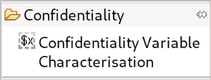
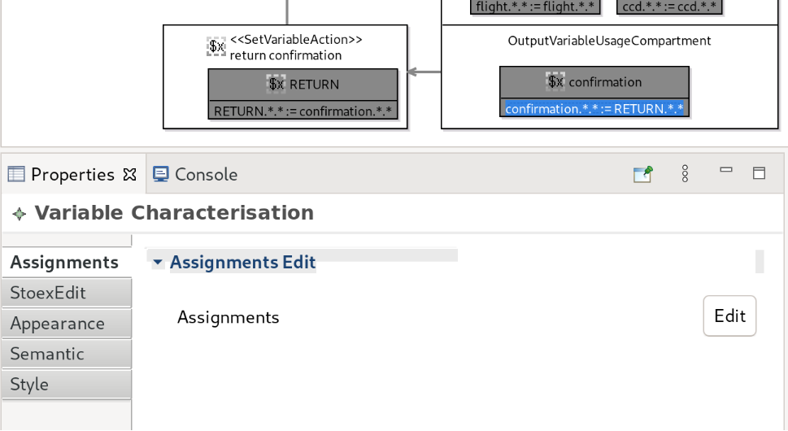
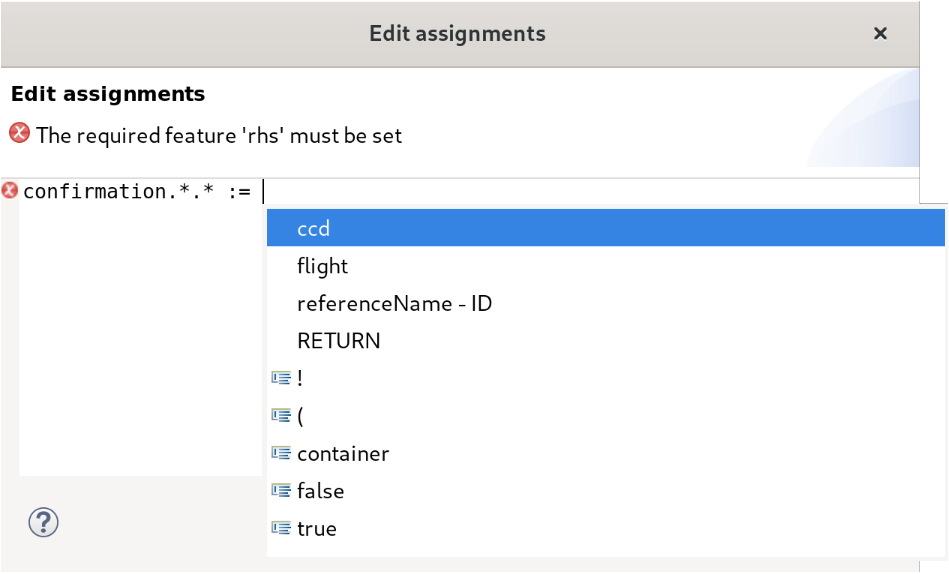

Defining Variable Usages for Confidentiality
============================================

Variable usages allow to define characteristics of variables, which can essentially be parameters and return values. The types of characteristics, which can be used, are given by a :doc:`data dictionary <xtext-datadictionary>`. The specification of characteristics is done by :dfn:`assignments`.

Prerequisites
-------------
In order to specify variable usages that can be used to reason about confidentiality, a :doc:`data dictionary <xtext-datadictionary>` has to exist and contain characteristic types. This is essentially because the characteristics are typed by the characteristic types in the data dictionary.

It is also necessary that the action holding the variable usage is already part of a control or usage flow. This means, the action has to be connected by the flow edges. Otherwise, determining the parameters and return values that can be used is not possible.

Creation of Characterizations
-----------------------------

.. _fig_sirius_variablecharacterization_confidentiality:

   Tool to create variable characterizations for confidentiality

.. _fig_sirius_variablecharacterization_confidentiality_assignmentsdialog:
.. figure:: _images/sirius-variablecharacterization-confidentiality-assignmentsdialog.png
   :align: right
   :width: 100 %
   :figwidth: 33 %
   :alt: Editing dialog that contains an assignment, which can be edited

   Dialog to edit assignments

A characterization is a sequence of assignments. To create such an assignment, you have to select the tool :guilabel:`Confidentiality Variable Characterisation` shown in :numref:`fig_sirius_variablecharacterization_confidentiality` from the palette and click into the corresponding variable usage. Afterwards, the dialog shown in :numref:`fig_sirius_variablecharacterization_confidentiality_assignmentsdialog` opens and you can write a sequence of assignments. The assignments have to follow the  :ref:`syntax <modeling/confidentiality-variableusages:Syntax of Assignments>` described later. After you confirm the dialog, the assignments will be created and shown within the variable usage in the graphical editor.

.. rst-class::  clear-both

Editing Existing Characterizations
----------------------------------

.. _fig_sirius_propertiesview_assignments:

   Properties view allowing to edit assignments

To edit existing characterizations, you have to use the properties view. First, select any assignment within the variable usage. After that, select the :guilabel:`Assignments` tab in the properties view that is also shown in :numref:`fig_sirius_propertiesview_assignments`. After pressing the :guilabel:`Edit` button, the dialog already known from creating the assignments (:numref:`fig_sirius_variablecharacterization_confidentiality_assignmentsdialog`) appears and you can edit the assignments. After confirming the dialog, all assignments are replaced by the assignments that you just specified in the dialog.

.. rst-class::  clear-both

Editing Support of Editor
-------------------------

.. _fig_sirius_variablecharacterization_confidentiality_assignmentsdialog_editingsupport:

   Editing support in assignments editor

The dialog provides editing support by code completion proposals and validation messages as shown in :numref:`fig_sirius_variablecharacterization_confidentiality_assignmentsdialog_editingsupport`.

The code completion proposals suggest keywords as well as elements that can be referenced. These suggestions only work if the action that contains the variable usage and therefore also the assignments is correctly integrated into the usage or control flow.

.. rst-class::  clear-both

Syntax of Assignments
---------------------

Assignments assign truth values to triples of variable, characteristic type and value. If the value is ``true``, the given value of the given characteristic type is available on the variable. If there is no assignment for a triple or the truth value is ``false``, the given value of the given characteristic type is not available on the variable. If there are multiple assignments to the same triple, only the last assignment is effective.

The syntax of an assignment is ``variable.characteristicType.value := Term``, where ``Term`` is a term that yields a truth value. The ``variable`` is always the variable defined by the variable usage. The ``characteristicType`` is one particular characteristic type from the :doc:`data dictionary <xtext-datadictionary>`. The ``value`` is one value from the enumeration that defined the value range of the characteristic type. The supported types of terms are given in :numref:`table_assignments_terms`.

.. _table_assignments_terms:
.. list-table:: Usable types of terms 
   :widths: 33 33 33
   :header-rows: 1

   * - Term Type
     - Syntax
     - Example
   * - Constant
     - true
     - true
   * - Constant
     - false
     - false
   * - Negation
     - !Term
     - !false
   * - Binary Logic
     - Term & Term
     - false & true
   * - Binary Logic
     - Term | Term
     - false | true
   * - Characteristic Reference
     - variable.characteristicType.value 
     - RETURN.color.red

A characteristic reference on the right hand side of the assignment can refer to available variables. Such variables typically are parameters or return values. By referring to other variables, the assignments specify a propagation of characteristics.

To simplify specifications, it is possible to omit the characteristic type and the value from characteristic references on the left hand side als well as on the right hand side of an assignment. To omit an element, you can add an asterisk ``*`` in the particular location. Please note that if you omit the characteristic type you also have to omit the value. Additionally, you can only omit elements on the right hand side of an assignment if you also omitted these elements on the left hand side of the assignment.

Assignments containing omissions will be instantiated with appropriate values during runtime. If you omit a value but specify a characteristic type having :math:`n` values, there will be virtually :math:`n` assignments. In assignment :math:`i` for :math:`0 \leqslant i < n` there will be the value with index :math:`i` be inserted in all places, in which a value has been omitted. If the characteritic type and the value have been omitted, there will be an assignment for every tuple of characteristic type and values of this characteristic type.

To illustrate the effect of omissions, let's assume there are the two characteristic types ``ForegroundColor`` and ``BackgroundColor``, which use the same enumeration specifying the colors ``Red``, ``Blue`` and ``Green``. We specify the variable ``out`` and can refer to a variable ``in``. The following examples show how omissions are handled for this particular example.

If you only omit the value, you have to ensure that the used characteristic types have compatible value ranges. The value ranges are compatible, if the characteristic types refer to the same enumeration. This implies that the value ranges are the same. The meaning of the following example is that the foreground color of the output variable shall have the background color of the input variable.

.. code-block:: rst

    out.ForegroundColor.* := in.BackgroundColor.*

becomes

.. code-block:: rst

    out.ForegroundColor.Red := in.BackgroundColor.Red
    out.ForegroundColor.Blue := in.BackgroundColor.Blue
    out.ForegroundColor.Green := in.BackgroundColor.Green

If you omit the characteristic type and the value on the left hand side of the assignment, you either have to omit both on the right hand side of the assignment or specify both. In the following example, the output variable shall have exactly the same characteristics as the input variable but only if the foreground color of the input variable is red.

.. code-block:: rst

    out.*.* := in.*.* & in.Foreground.Red

becomes

.. code-block:: rst

    out.ForegroundColor.Red := in.ForegroundColor.Red & in.Foreground.Red
    out.ForegroundColor.Blue := in.ForegroundColor.Blue & in.Foreground.Red
    out.ForegroundColor.Green := in.ForegroundColor.Green & in.Foreground.Red
    out.BackgroundColor.Red := in.BackgroundColor.Red & in.Foreground.Red
    out.BackgroundColor.Blue := in.BackgroundColor.Blue & in.Foreground.Red
    out.BackgroundColor.Green := in.BackgroundColor.Green & in.Foreground.Red

If you specify multiple assignments for the same variable (as shown in the example before), you have to use a simplified syntax. In case of the example shown before, the correct syntax would have to be like in the following excerpt.

.. code-block:: rst

    out. {
      ForegroundColor.Red := in.ForegroundColor.Red & in.Foreground.Red
      ForegroundColor.Blue := in.ForegroundColor.Blue & in.Foreground.Red
      ForegroundColor.Green := in.ForegroundColor.Green & in.Foreground.Red
      BackgroundColor.Red := in.BackgroundColor.Red & in.Foreground.Red
      BackgroundColor.Blue := in.BackgroundColor.Blue & in.Foreground.Red
      BackgroundColor.Green := in.BackgroundColor.Green & in.Foreground.Red
    }