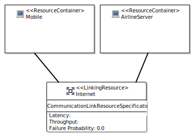
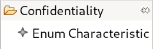
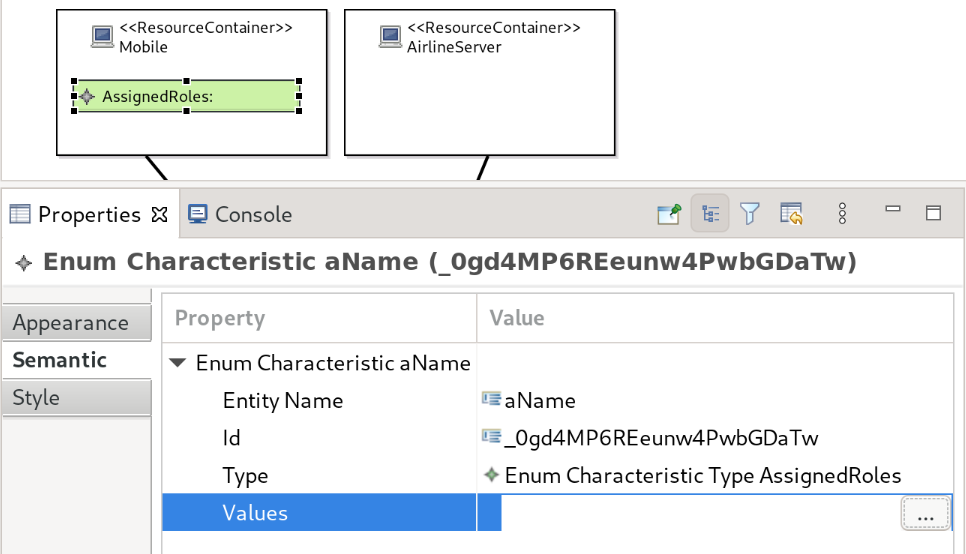

Usage of Resource Environment Editor
====================================

The resource environment editor allows to specify the resources, to which system parts can be deployed.

Contents of Editor
------------------

.. _fig_sirius_resourceenvironment:

   Simple resource environment

The editor consists of resource containers that can host system parts as well as links that connect resource containers.

.. rst-class::  clear-both

Specification of Characteristics for Resource Containers
--------------------------------------------------------

Resource containers can have characteristics assigned. To assign characteristics, a :doc:`data dictionary <xtext-datadictionary>` has to exist and contain characteristic types. This is essentially because the characteristics are typed by the characteristic types in the data dictionary.

.. _fig_sirius_tool_enumcharacteristic:

   Tool for creating a characteristic

.. _fig_sirius_tool_enumcharacteristic_dialog:
.. figure:: _images/sirius-tool-enumcharacteristic-dialog.png
   :align: right
   :width: 100 %
   :figwidth: 33 %
   :alt: Dialog asking to select a characteristic type

   Selection dialog for characteristic type

In order to create a characteristic, you have to select the corresponding tool shown in :numref:`fig_sirius_tool_enumcharacteristic` and click into a resource container. This will open the dialog shown in :numref:`fig_sirius_tool_enumcharacteristic_dialog` that asks for a characteristic type. Select the characteristic type, for which you would like to select values later. After you selected a type, press :guilabel:`OK`.

.. _fig_sirius_resourceenvironment_enumcharacteristic:

   Value selection for characteristics

A green rectangle will be added to the resource container as shown in :numref:`fig_sirius_resourceenvironment_enumcharacteristic`. Initially, there are no values selected. You can change this by using the semantic tab of the properties view. Click into the cell in the :guilabel:`Value` column next to the :guilabel:`Values` property and press the :guilabel:`...` button. In the opened dialog, you can select the values to be applied by double-clicking on them or selecting them and pressing :guilabel:`Add`. You can remove them again by double-clicking them or using the :guilabel:`Remove` button. After closing the dialog by pressing :guilabel:`OK`, the new values are visualized in the green rectangle.