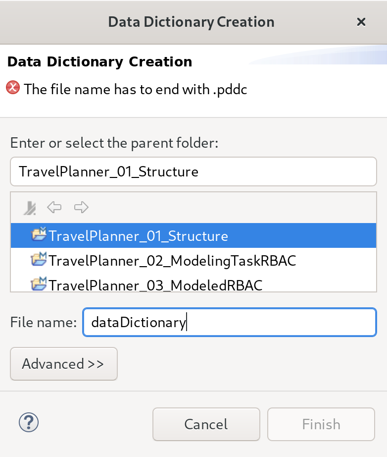

Specifying a Data Dictionary
============================

The :dfn:`data dictionary` holds the characteristic types including their value ranges. These types are used for specifying characteristics of nodes and data transmitted through the system.

Dictionary creation
-------------------

.. _fig_ui_toolbar_palladio:
.. figure:: _images/palladio-toolbar.png
   :align: right
   :width: 100 %
   :figwidth: 33 %
   :alt: Toolbar containing actions to create Palladio models

   Palladio toolbar

In order to create a dictionary, you can use the Palladio toolbar located in the top of the tooling window that is shown in :numref:`fig_ui_toolbar_palladio`. To create a dictionary, press the button named :guilabel:`DD` next to the usage model button.

.. _fig_dialog_dd_creation:

   Dialog for creating a data dictionary

In the upcoming dialog shown in :numref:`fig_dialog_dd_creation`, you have to select the project, into which you would like to put the data dictionary. The file name of the dictionary can be chosen freely but has to end with :file:`.pddc`. A validation message in the top of the dialog reports if the file name is valid.

After pressing :guilabel:`OK`, the dictionary is created and a textual editor for that dictionary will be opened.

.. rst-class::  clear-both

Editing Support of Editor
-------------------------

.. _fig_xtext_ddc_editingsupport:
.. figure:: _images/xtext-ddc-editingsupport.png
   :align: right
   :width: 100 %
   :figwidth: 33 %
   :alt: Visualization of code completion proposals and validation messages in editor.

   Editing support in dictionary editor

The editor provides editing support by code completion proposals, syntax highlighting and validation messages as shown in :numref:`fig_xtext_ddc_editingsupport`.

The code completion proposals suggest keywords as well as elements that can be referenced. Validation messages indicate if entries are valid.

.. rst-class::  clear-both

Syntax of Dictionary
--------------------

Every dictionary starts with the keyword ``dictionary`` followed by an ``id`` keyword and a unique identifier. There is usually no reason to change the generated identifier. After the identifier, there can be multiple enumerations and characteristic types.

Enumerations start with the keyword ``enum`` followed by a name. The actual values contained in the enumeration are enclosed by curly brackets. Individual keywords are separated by at least one whitespace character such as a single whitespace or a line break. An enumeration holding the colors red, green and blue would look like follows.

.. code-block:: rst

    enum Colors {
      Red
      Green
      Blue
    }

Enum characteristic types use enumerations to specify their possible values. Such a characteristic type starts with the keywords ``enumCharacteristicType`` followed by a name for the type. The used enumeration is specified by the keyword ``using`` followed by the name of the enumeration. A enum characteristic type describing background colors would look like follows.

.. code-block:: rst

    enumCharacteristicType BackgroundColor using Colors

.. warning::
   Avoid to change the order of characteristic types or deleting a characteristic type after you used a characteristic type in a system. Otherwise, the internal references between the system and the dictionary will break and you have to recreate everything that made use of a characteristic type.

   Instead of removing a characteristic type, you might want to change the name or just don't use it anymore. You can always add new characteristic types.

